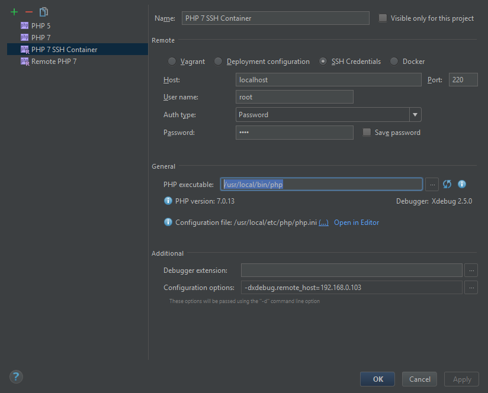
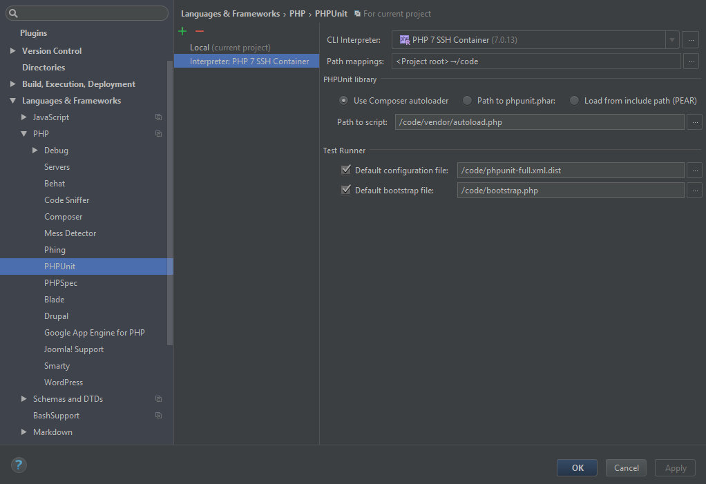

# Setting up 

## Start containers 
The container uses host docker, which means that `/var/run/docker.sock` must be available to share to the container. If it is not or if it does not work, then 
`DOCKER_HOST` environment variable will be used.

PHPStorm can deploy using docker-compose, but it cannot run PHPUnit tests in an existing container (nor create one using docker-compose), we have to create the container manually and then connect to it via SSH.

Run:

```
docker-compose up
```

You should end up with:

```
> docker ps
CONTAINER ID        IMAGE                COMMAND                  CREATED             STATUS              PORTS                                      NAMES
717fce927200        dockertests_runner   "/buildcode/start.sh"    4 seconds ago       Up 2 seconds        0.0.0.0:220->22/tcp, 0.0.0.0:800->80/tcp   test_runner_php
762c65067822        mysql:5.7            "docker-entrypoint..."   11 minutes ago      Up 6 seconds        0.0.0.0:3306->3306/tcp                     test_runner_database
ddeb7f99c326        elasticsearch:2.4    "/docker-entrypoin..."   5 days ago          Up 6 seconds        0.0.0.0:9200->9200/tcp, 9300/tcp           test_runner_elastic
```

## Setup PHPStorm CLI Interpreter

### Interpreter
Go to `Settings > Languages & Frameworks > PHP` and add new Interpreter:

- Choose `remote` and `SSH Credentials`
- Host: localhost
- Port: 220
- User name: root
- Password: root
- PHP Executable: /usr/local/bin/php



At this moment, PHP version and XDebug should be detected successfully. Add configuration `xdebug.remote_host` and set it to IP Address of your host **as seen from within** the container.
Since the container is in `bridge` mode, it can also be local IP of the host.

Close the *CLI interpreter* dialog and edit `Path mappings:` to '<Project root>→/code'. Set the newly added interpreter as default for the project.

### PhpUnit
Got to `Settings > Languages & Frameworks > PHP > PHPUnit` and add a new Remote Interpreter. Select the interpreter created in previous step and fill:

- Use Composer autoloader: `/code/vendor/autoload.php`
- Default configuration file: `/code/phpunit-full.xml.dist`
- Default bootstrap file: `/code/bootstrap.php`



### Run PHPUnit
Create a new PHPUnit Run configuration. You shouldn't need to set anything in the Run configuration.

## Troubleshooting:

- If something goes wrong with the database, simply delete the `docker-tests/db/data/` folder. The database will be recreated from the `docker-tests/db/init/` folder.
- If something goes wrong with Elastic, simply delete the entire container `docker rm test_runner_elastic`, it will be recreated with next `docker-compose up`.
- If the container cannot connect to docker, verify that `DOCKER_HOST` is set properly (container inherits its setting from the host). Verify that the value is correct by running e.g.:
`docker -H tcp://192.168.0.103:2375 run hello-world`. It mustn't be set to localhost.
- If you can access docker from within the container but the unit tests still fail, try setting `DOCKER_HOST=tcp://192.168.0.103:2376` in the Environment variables for the unit test.
- If the tests are interrupted in the middle with exit code -1 and no error, try setting up `COMPOSE_HTTP_TIMEOUT` environment variable to a high value (e.g. 8000)
- If something else with XDebug fails, verify that the commandline PHPStorm uses to run the test is something like this:
```
ssh://root@localhost:220/usr/local/bin/php -dxdebug.remote_enable=1 -dxdebug.remote_mode=req -dxdebug.remote_port=9000 -dxdebug.remote_host=172.17.0.1 -dxdebug.remote_host=192.168.0.103 /code/vendor/phpunit/phpunit/phpunit --bootstrap /code/bootstrap.php --configuration /code/phpunit-full.xml.dist --teamcity
```

## Tricks:

- You can run commands in the container either via docker: `docker exec -i -t test_runner_php /bin/bash` or via ssh to `localhost:220` and credentials `root:root`
- When building container `test_runner_php` the code is mapped via volume `../:/code/` This means that when the image is first build, the `vendor` directory is created and PHPStorm can do library dependencies will be resolved. You should delete the `vendor` directory before first running the container and also you should run `composer update` inside the container (otherwise different host PHP and container PHP versions may lead to different dependencies).

